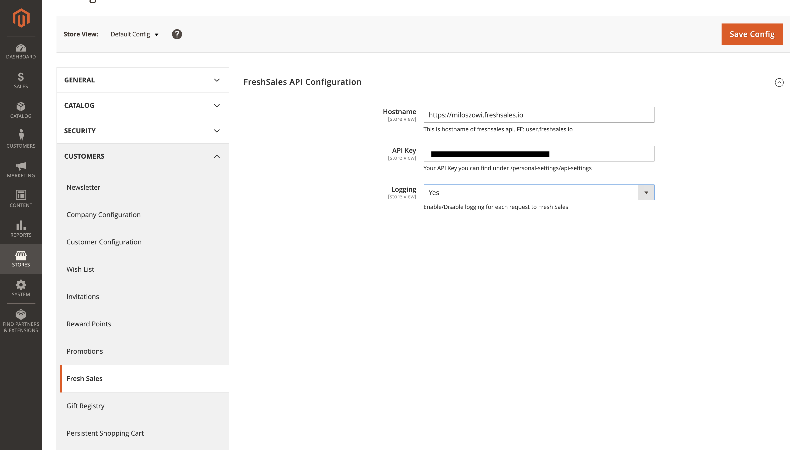
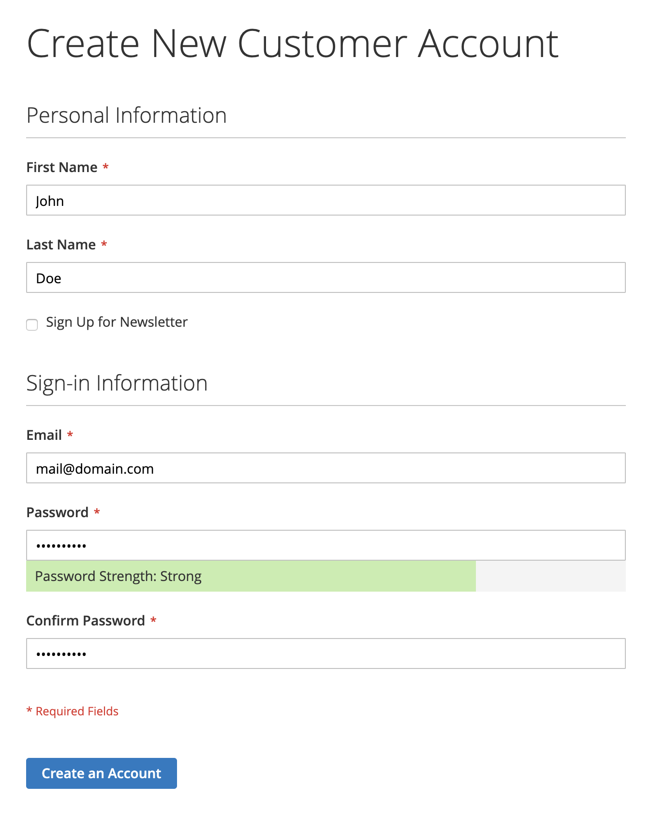
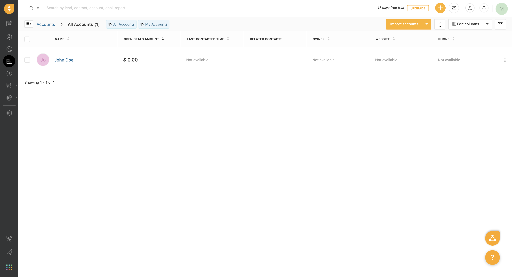
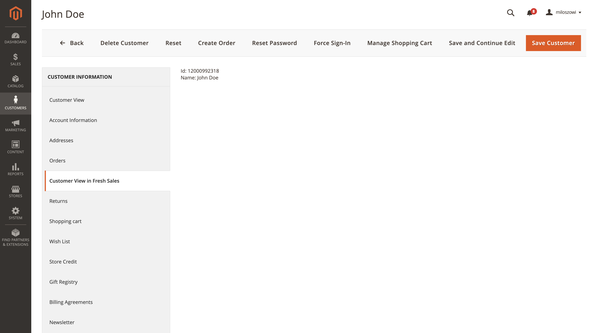

# Miloszowi_FreshSales

Module communicates with Fresh Sales API upon user registration (only frontend) and creates an account in its system.
## Installation
- `composer require miloszowi/fresh-sales`
- `php bin/magento module:enable Miloszowi_FreshSales`
- `php bin/magento setup:upgrade`
- `php bin/magento setup:di:compile`

## Overview

#### System configuration for the module
You can find it under
**System -> Configuration -> Customer -> Fresh Sales**


#### User registration 

### Customer view in fresh sales after successfull registration

### Customer view in Magento admin panel


#### Logging
We can enable/disable logging in system configuration. 
Once enabled, each request & error & response will be logged to `/var/logs/freshsales.log`

Example:
```$xslt
[2020-02-13 21:19:39] report.ERROR: Something went wrong during creating HTTP Request: Client error: `POST https://miloszowi.freshsales.io/api/sales_accounts` resulted in a `400 Bad Request` response:
{"errors":{"code":400,"message":["Name has already been taken"]}}
 [] []
[2020-02-13 21:21:03] report.INFO: {"type":"Request to Freshsales","url":"https:\/\/miloszowi.freshsales.io\/api\/sales_accounts","httpMethod":"POST","headers":{"Content-Type":"application\/json","Authorization":"Token token=[token_value]"},"body":{"sales_account":{"name":"John Doe","updated_at":"2020-02-13 21:20:53"}}} [] []
[2020-02-13 21:21:14] report.INFO: {"statusCode":200,"response":"{\"sales_account\":{\"id\":12000992318,\"name\":\"John Doe\",\"address\":null,\"city\":null,\"state\":null,\"zipcode\":null,\"country\":null,\"number_of_employees\":null,\"annual_revenue\":null,\"website\":null,\"owner_id\":null,\"phone\":null,\"open_deals_amount\":\"0.0\",\"open_deals_count\":0,\"won_deals_amount\":\"0.0\",\"won_deals_count\":0,\"last_contacted\":null,\"last_contacted_mode\":null,\"facebook\":null,\"twitter\":null,\"linkedin\":null,\"links\":{\"conversations\":\"\/sales_accounts\/12000992318\/conversations\/all?include=email_conversation_recipients%2Ctargetable%2Cphone_number%2Cphone_caller%2Cnote%2Cuser\\u0026per_page=3\",\"document_associations\":\"\/sales_accounts\/12000992318\/document_associations\",\"notes\":\"\/sales_accounts\/12000992318\/notes?include=creater\",\"tasks\":\"\/sales_accounts\/12000992318\/tasks?include=creater,owner,updater,targetable,users,task_type\",\"appointments\":\"\/sales_accounts\/12000992318\/appointments?include=creater,owner,updater,targetable,appointment_attendees\"},\"custom_field\":{},\"created_at\":\"2020-02-13T21:21:03Z\",\"updated_at\":\"2020-02-13T21:21:03Z\",\"avatar\":null,\"parent_sales_account_id\":null,\"recent_note\":null,\"last_contacted_via_chat\":null,\"last_contacted_via_sales_activity\":null,\"last_contacted_sales_activity_mode\":null,\"completed_sales_sequences\":null,\"active_sales_sequences\":null,\"last_assigned_at\":null,\"tags\":[],\"is_deleted\":false,\"team_user_ids\":null,\"has_connections\":false}}"} [] []
```


## License
[MIT](https://choosealicense.com/licenses/mit/)

### Author 
Miłosz Guglas

miloszweb@gmail.com
